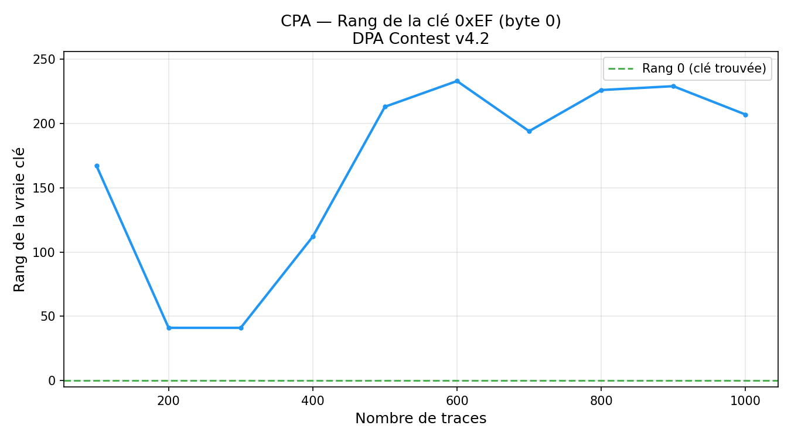
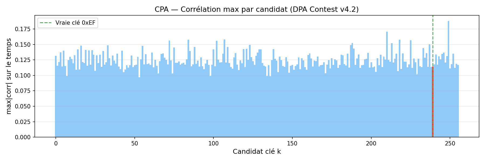
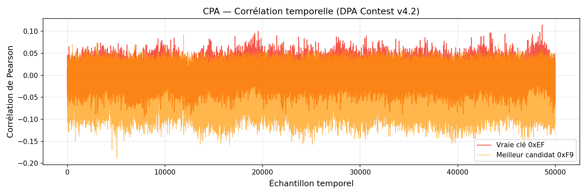

# A-CPA — Correlation Power Analysis sur DPA Contest v4.2 (AES-128 RSM)

## Objectif

Appliquer une attaque CPA (Correlation Power Analysis) sur des traces EM réelles d'un AES-128
protégé par RSM (Rotating S-Boxes Masking) et mesurer l'efficacité du contre-mesure.

## Dataset

| Paramètre | Valeur |
|-----------|--------|
| Source | DPA Contest v4.2 (ANSSI/Télécom ParisTech) |
| Traces disponibles | 2 500 (indices 7500–9999 sur 10 000) |
| Longueur d'une trace | 1 704 402 échantillons EM |
| Format | LeCroy binaire compressé (.trc.bz2) |
| Dispositif | AES-128 RSM sur FPGA |
| Octet ciblé | Byte 0 de la clé (`k[0] = 0xEF`) |
| Clé complète | `EF38C2AF582A7E6B14255D139E9DBEFC` |

### Contre-mesure : RSM (Rotating S-Boxes Masking)

RSM remplace la S-box fixe AES par une S-box « rotée » aléatoire à chaque chiffrement :
```
SBox_RSM[i] = (SBox[i] + r) mod 256   avec r masque aléatoire uniforme
```
Le modèle de fuite `HW(SBox[pt^k])` standard est donc décorrélé : le masque additif `r`
annule toute corrélation au premier ordre.

---

## Méthode CPA

**Modèle de fuite :** Hypothèse de Hamming Weight sur la sortie S-box non masquée

```
h[k] = HW(SBox[pt ^ k])   pour chaque candidat k ∈ {0, ..., 255}
```

**Corrélation de Pearson vectorisée (256 candidats simultanément) :**

```
corr(k) = (Hc^T @ Xc) / (||Hc|| * ||Xc||)
```

où `Hc = H - mean(H)` et `Xc = X - mean(X)`.

**Rang :** position de la vraie clé dans la liste triée par `max_t |corr(k, t)|`.

---

## Paramètres

| Paramètre | Valeur |
|-----------|--------|
| Traces utilisées | 1 000 |
| Fenêtre temporelle | [0, 50 000] échantillons |
| Pic de corrélation | Échantillon ~19 585 |
| Modèle | HW(SBox[pt ^ k]) |

---

## Résultats

### Rang final (1 000 traces)

| N traces | Rang vraie clé | Corr vraie clé | Meilleur candidat |
|----------|---------------|----------------|-------------------|
| 100      | 167 / 256     | 0.368          | —                 |
| 200      | 41 / 256      | 0.295          | —                 |
| 300      | 41 / 256      | 0.250          | —                 |
| 500      | 213 / 256     | 0.159          | —                 |
| 1 000    | **207 / 256** | **0.114**      | —                 |

**Le CPA ne converge pas.** La corrélation de la vraie clé décroît vers zéro au lieu d'augmenter,
et le rang reste au-dessus de 40 — aucune convergence vers le rang 1.

### Courbe de rang



Le rang oscille entre 40 et 230 sans tendance descendante — comportement caractéristique d'une
attaque échouant face à un masquage.

### Corrélations par candidat



Aucun candidat ne se détache clairement. La vraie clé (rouge) n'a pas la plus grande corrélation.

### Corrélation temporelle



---

## Analyse : Pourquoi CPA échoue sur RSM

| Aspect | Explication |
|--------|-------------|
| **Modèle HW** | Prédit `HW(SBox[pt^k])`, mais la fuite réelle est `HW(SBox_RSM[pt^k]) = HW(SBox[pt^k] ^ r)` |
| **Décorrélation** | Le masque `r` uniforme rend `E[HW(SBox[pt^k] ^ r)] = 4` constant pour tout `k` et `pt` |
| **Corrélation → 0** | Avec plus de traces, la corrélation converge vers 0 (visible : 0.37 → 0.11) |
| **Remède** | Attaque d'ordre 2 (combiner deux moments) ou Deep Learning (CNN apprend les statistiques masquées) |

### Comparaison avec ASCAD (masquage booléen)

| Dataset | Masquage | CPA | DL-CNN |
|---------|----------|-----|--------|
| ASCAD (projet DL) | Booléen XOR | Rang 71 ❌ | Rang 1 ✅ (10 traces) |
| DPA Contest v4.2 | RSM additif | Rang 207 ❌ | — |

Les deux masquages résistent complètement au CPA premier ordre.

---

## Structure du projet

```
A-CPA/
├── analysis/
│   └── cpa.py      # CPA vectorisé (matmul numpy), parseur LeCroy bz2
└── results/
    ├── 01_rank_curve.png           # Rang vs nombre de traces
    ├── 02_correlation_bar.png      # max|corr| par candidat
    └── 03_temporal_correlation.png # Corrélation temporelle
```

---

## Références

- DPA Contest v4.2 : http://www.dpacontest.org/v4/
- Nassar et al. (2012). *RSM: A Small and Fast Countermeasure for AES, Secure against 1st and 2nd-order Zero-Offset SCAs*. DATE 2012.
- Standaert et al. (2008). *A Unified Framework for the Analysis of Side-Channel Key Recovery Attacks*. EUROCRYPT 2008.
