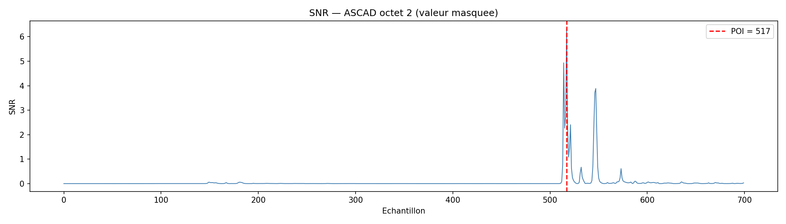
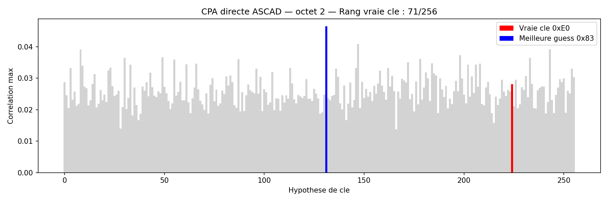
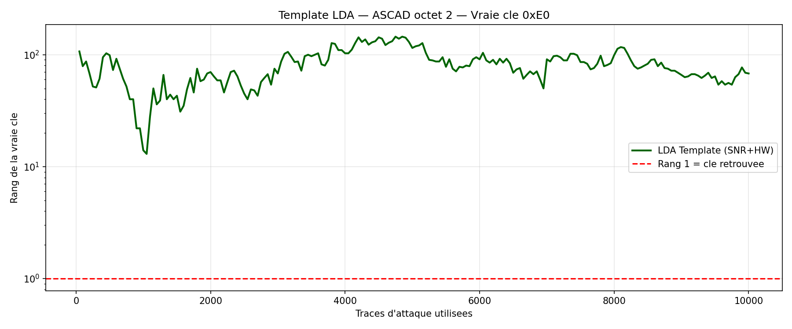

# ASCAD — Analyse par Canal Auxiliaire sur AES Masqué

## Objectif

Évaluer les méthodes classiques d'analyse par canal auxiliaire (SNR, CPA, Template LDA)
sur la base ASCAD — une implémentation AES-128 **masquée au premier ordre** sur ATMega8515.

## Dataset

| Paramètre | Valeur |
|-----------|--------|
| Source | ASCAD.h5 (ANSSI/CEA, 2018) |
| Traces de profiling | 50 000 |
| Traces d'attaque | 10 000 |
| Longueur d'une trace | 700 échantillons EM |
| Implémentation | AES-128 masqué booléen, ATMega8515 |
| Octet ciblé | Byte 2 — `SBox[pt[2] XOR k[2]]` |

## Principe du masquage booléen

L'implémentation masque la sortie de la SBox :

```
z = SBox[pt[2] XOR k[2]] XOR mask[2]   ← valeur masquée qui fuit dans la trace
```

Le masque `mask[2]` est aléatoire et renouvelé à chaque trace.
Ce masquage **protège contre les attaques d'ordre 1** en rendant l'intermédiaire sensible uniforme.

---

## Étape 1 — SNR (Signal-to-Noise Ratio)

**Script :** `analysis/snr.py`

Le SNR identifie les échantillons de la trace qui fuient de l'information sur l'intermédiaire masqué.

**Résultat :** Pic SNR détecté à l'échantillon 517, SNR = 6.33

Le signal existe bien — la trace EM révèle l'intermédiaire masqué `z`.



---

## Étape 2 — CPA (Correlation Power Analysis)

**Script :** `analysis/cpa.py`

Attaque directe non-profilée sur la variable non masquée `SBox[pt XOR k]`.

| Métrique | Valeur |
|----------|--------|
| Traces utilisées | 10 000 |
| Rang final de la vraie clé | **71 / 256** |
| Résultat | **Échec** |

**Pourquoi ça échoue :** La CPA corrèle la trace avec `HW(SBox[pt XOR k])`.
Mais la trace fuit `z = SBox[pt XOR k] XOR mask`, pas `SBox[pt XOR k]`.
Le masque aléatoire décore complètement le signal en premier ordre.



---

## Étape 3 — Template LDA (attaque profilée)

**Script :** `analysis/lda.py`

Attaque profilée avec connaissance du masque (scénario évaluation).

### Approche

| Étape | Détail |
|-------|--------|
| Labels profiling | `z = SBox[pt XOR k] XOR mask` — 256 classes masquées |
| Modèle HW | Regroupement en 9 classes Hamming Weight de `z` |
| Sélection features | Top-100 échantillons par SNR (entre-classes / intra-classes) |
| Classifieur | LDA sklearn (covariance partagée) |
| Scoring attaque | `score(k) = Σ log P(HW(SBox[pt_i XOR k] XOR mask_i) | trace_i)` |

### Résultats

| Métrique | Valeur |
|----------|--------|
| Accuracy HW profiling | 27.2 % |
| Accuracy HW attaque | 26.9 % |
| Aléatoire | 11.1 % |
| Signal `log P(vrai HW) - mean` | +1.26 par trace |
| Rang final (10 000 traces) | **68 / 256** |
| Rang 1 atteint | Non |

### Pourquoi le modèle généralise mais ne converge pas

- **Généralise :** 27.2% ≈ 26.9% → les features SNR sont stables entre profiling et attaque
- **Limitation HW :** Le modèle à 9 classes HW est trop grossier — plusieurs clés candidates produisent le même HW pour une même trace, rendant leur distinction lente
- **Limitation masquage :** Le masquage booléen étale l'intermédiaire sur 256 valeurs uniformes, réduisant le signal disponible par trace



---

## Comparaison des méthodes

| Méthode | Type | Masque utilisé | Rang final | Résultat |
|---------|------|----------------|-----------|----------|
| CPA | Non profilée | Non | 71/256 | ❌ Échec |
| LDA Template (HW) | Profilée | Oui (connu) | 68/256 | ⚠️ Partiel |
| Deep Learning | Profilée | Non nécessaire | — | → Prochain projet |

**Observation clé :** Même avec connaissance parfaite du masque (avantage irréaliste en pratique),
le LDA classique n'arrive pas à atteindre le rang 1 sur 10 000 traces.
Le masquage booléen protège efficacement contre les méthodes linéaires.

---

## Conclusion

Les méthodes classiques (CPA, Template LDA) **échouent ou peinent** sur l'ASCAD masqué :

- La CPA échoue car le masque décore le signal au premier ordre
- Le LDA avec masque connu améliore légèrement (71→68) mais reste insuffisant
- Le signal par trace est trop faible pour que la classification linéaire converge

**Ce résultat motive directement l'utilisation du Deep Learning** (MLP/CNN),
qui peut apprendre des statistiques d'ordre supérieur et combiner plusieurs points de fuite simultanément,
comme démontré dans le projet DL-SCA.

---

## Structure du projet

```
ASCAD/
├── analysis/
│   ├── explore.py      # Chargement et visualisation des traces
│   ├── snr.py          # Signal-to-Noise Ratio
│   ├── cpa.py          # Correlation Power Analysis
│   └── lda.py          # Template LDA (SNR + HW + sklearn)
└── results/
    ├── 01_traces_brutes.png
    ├── 02_snr.png
    ├── 03_cpa_echec.png
    └── 04_lda_rank.png
```

## Références

- Benadjila et al. (2018). *Study of Deep Learning Techniques for Side-Channel Analysis and Introduction to ASCAD Database*. IACR ePrint 2018/053.
- ASCAD GitHub : https://github.com/ANSSI-FR/ASCAD
- SCALib : https://scalib.readthedocs.io
