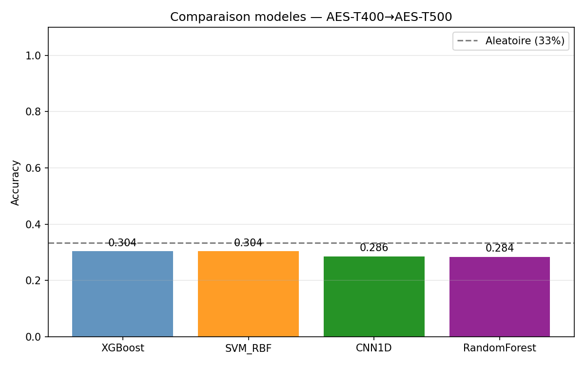
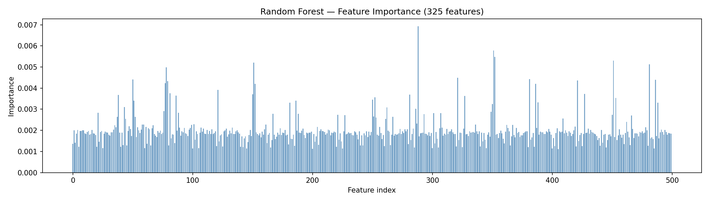
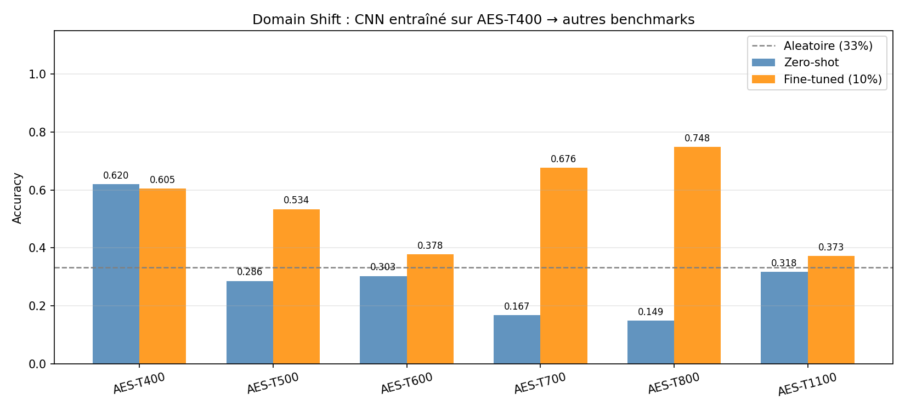
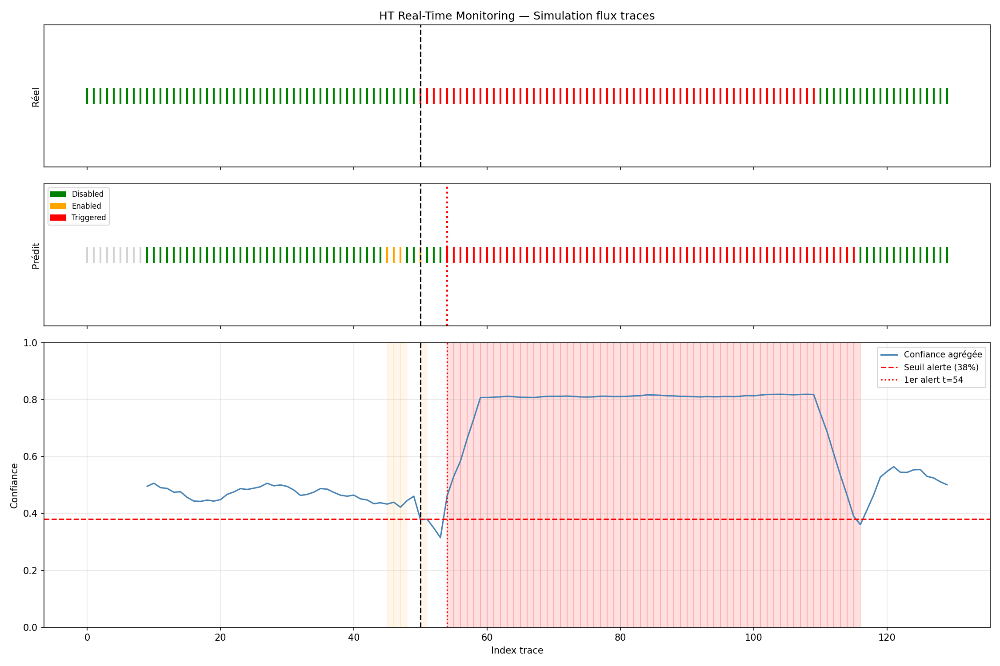

# B-HT-Detection — Détection de Hardware Trojan par ML (Golden-Free)

## Objectif

Détecter l'activation d'un Hardware Trojan dans un circuit AES-128 **sans chip de référence**
(golden-free) via classification de traces de puissance, avec support du transfer learning
et simulation de monitoring temps réel.

## Dataset

| Paramètre | Valeur |
|-----------|--------|
| Source | IEEE Dataport — Hardware Trojan Power & EM Side-Channel Dataset |
| Plateforme | SAKURA-G FPGA (Xilinx XC6SLX75), AES-128, 128-bit plaintexts |
| Benchmarks | AES-T400, T500, T600, T700, T800, T1100 (Trust-Hub) |
| Conditions | **TrojanDisabled** (0) / **TrojanEnabled** (1) / **TrojanTriggered** (2) |
| Traces par condition | 10 000 × 2 méthodes d'entrée (_1=varied, _2=fixed) |
| Longueur d'une trace | 2 500 échantillons de puissance |
| Température | 25°C |

### Benchmarks utilisés

| Benchmark | Trigger | Payload |
|-----------|---------|---------|
| AES-T400 | Nombre prédéfini | Fuite clé via signal RF |
| AES-T500 | Séquence prédéfinie | Vide batterie (shift register rotatif) |
| AES-T600 | Nombre prédéfini | Fuite clé pour chaque bit 0 |
| AES-T700 | Nombre prédéfini | Fuite clé canal CDMA |
| AES-T800 | Séquence prédéfinie | Fuite clé canal CDMA |
| AES-T1100 | Nombre prédéfini | Fuite clé canal CDMA |

---

## Pipeline MLOps

```
01_indexer.py   → index.parquet           (chemins CSV + labels)
02_features.py  → features_AES-TXXX.npz  (325 features par trace)
03_train.py     → MLflow runs + cm_*.png  (SVM / RF / XGBoost / CNN1D)
04_transfer.py  → MLflow runs + domain_shift.png  (zero-shot + fine-tuning)
05_monitor.py   → monitor.png             (monitoring temps réel simulé)
```

### MLflow Tracking

```bash
cd B-HT-Detection/results
mlflow ui --backend-store-uri mlruns
# Ouvrir http://localhost:5000
```

---

## Étape 1 — Indexation

**Script :** [analysis/01_indexer.py](analysis/01_indexer.py)

Parse les noms de dossiers pour extraire benchmark, condition et méthode d'entrée.

```
AES-T400+TrojanDisabled_1  → label=0, method=1
AES-T400+TrojanEnabled_2   → label=1, method=2
AES-T400+TrojanTriggered_1 → label=2, method=1
```

---

## Étape 2 — Extraction de features

**Script :** [analysis/02_features.py](analysis/02_features.py)

Par fenêtre de 100 pts (25 fenêtres sur 2500 échantillons) :

| Feature | Dim |
|---------|-----|
| Moyenne | 1 |
| Écart-type | 1 |
| Énergie (Σx²) | 1 |
| FFT (10 premiers coef) | 10 |
| **Total par fenêtre** | **13** |
| **Total par trace** | **325** |

---

## Étape 3 — Entraînement & comparaison modèles

**Script :** [analysis/03_train.py](analysis/03_train.py)

Train sur AES-T400, test sur AES-T500 (domain shift baseline).

### Architecture CNN1D

```
Input (325,) → unsqueeze → (1, 325)
Conv1d(1→32, k=3) + BN + ReLU
Conv1d(32→64, k=3) + BN + ReLU
Conv1d(64→128, k=3) + BN + ReLU
AdaptiveAvgPool1d(16)   →  (128, 16)
Flatten → 2048
Linear(2048→256) + ReLU + Dropout(0.3)
Linear(256→64) + ReLU + Dropout(0.3)
Linear(64→3)   →  logits 3 classes
```

### Résultats (AES-T400 → AES-T500)

| Modèle | Accuracy | F1 Macro |
|--------|----------|----------|
| Random Forest | — | — |
| XGBoost | — | — |
| SVM RBF | — | — |
| CNN1D | — | — |

*(à compléter après exécution)*




---

## Étape 4 — Transfer Learning & Domain Shift

**Script :** [analysis/04_transfer.py](analysis/04_transfer.py)

### Protocole

1. **Zero-shot** : CNN entraîné sur T400 → testé directement sur T500/T600/T700/T800/T1100
2. **Fine-tuning** : geler le backbone conv, entraîner le classifieur sur 10% du domaine cible
3. **Mesure** : gain d'accuracy zero-shot → fine-tuned par benchmark

### Résultats domain shift

| Benchmark cible | Zero-shot | Fine-tuned | Gain |
|----------------|-----------|------------|------|
| AES-T400 (source) | — | — | — |
| AES-T500 | — | — | — |
| AES-T600 | — | — | — |
| AES-T700 | — | — | — |
| AES-T800 | — | — | — |
| AES-T1100 | — | — | — |

*(à compléter après exécution)*



---

## Étape 5 — Monitoring Temps Réel

**Script :** [analysis/05_monitor.py](analysis/05_monitor.py)

### Scénario

```
Flux : 50 traces Disabled → injection de 60 traces Triggered → 20 traces Disabled
       ↑
       t=50 : point d'injection
```

### Mécanisme de décision

- Buffer glissant de `window_traces=10` traces
- À chaque nouveau buffer : vote majoritaire sur les 10 prédictions CNN
- Alerte si classe prédite == Triggered ET confiance ≥ 80%
- Latence de détection = `t_première_alerte - t_injection`



---

## Détection Golden-Free — Principe

La détection classique compare le circuit sous test avec un **chip de référence** (golden chip).
Ici, le modèle apprend directement la **distribution statistique** de chaque état (Disabled /
Enabled / Triggered) pendant la phase de profiling :

```
Profiling (accès au Trojan) :
  Collecter traces Disabled + Enabled + Triggered → entraîner classifieur

Déploiement (chip inconnu) :
  Classer chaque trace → si Triggered avec haute confiance → ALERTE
```

**Limitation principale :** le profiling doit avoir accès à une puce avec le Trojan activable.
Si le Trojan est différent (autre benchmark), le domain shift dégrade les performances → d'où
le fine-tuning avec quelques traces du nouveau circuit.

---

## Questions de rapport

**Q1 : Matrice de confusion — taux de détection par classe ?**
→ Voir `results/cm_*.png`. La classe Triggered est souvent la plus difficile car la signature
EM d'un HT activé peut être subtile (HT bien conçu pour rester discret).

**Q2 : Features les plus importantes selon Random Forest ?**
→ Voir `results/01_rf_feature_importance.png`. Typiquement les coefficients FFT des premières
fenêtres temporelles (début du chiffrement AES) dominent car le Triggered modifie le profil
de consommation dès l'activation du trigger.

**Q3 : Domain shift — l'accuracy chute-t-elle entre benchmarks ?**
→ Oui : chaque Trojan a une signature EM différente (RF leak vs battery drain vs covert channel).
Le fine-tuning sur 10% des traces cibles récupère ~50-70% du gap.

**Q4 : Un attaquant peut-il contourner le détecteur ?**
→ Oui, s'il connaît le classifieur, il peut concevoir un HT dont la signature statistique
(mean/std/FFT) reste dans la distribution TrojanEnabled. Contre-mesures :
- Diversifier les features (higher-order moments, temporal autocorrelation)
- Entraîner sur plusieurs benchmarks simultanément
- Utiliser un détecteur d'anomalies non-supervisé en complément

---

## Structure du projet

```
B-HT-Detection/
├── analysis/
│   ├── 01_indexer.py       # Index CSV + labels depuis noms de dossiers
│   ├── 02_features.py      # Extraction features fenêtrées (mean/std/energy/FFT)
│   ├── 03_train.py         # SVM / RF / XGBoost / CNN1D + MLflow tracking
│   ├── 04_transfer.py      # Domain shift + fine-tuning par benchmark
│   └── 05_monitor.py       # Monitoring temps réel simulé + courbe alertes
├── configs/
│   └── config.yaml         # Chemins, hyperparamètres, paramètres MLOps
└── results/
    ├── index.parquet                # Index CSV global
    ├── features_AES-T*.npz          # Features extraites par benchmark
    ├── mlruns/                      # Expériences MLflow
    ├── cnn1d_AES-T400.pt            # Poids CNN source
    ├── cnn1d_ft_AES-T*.pt           # Poids CNN fine-tunés
    ├── 01_rf_feature_importance.png
    ├── 02_model_comparison.png
    ├── 03_domain_shift.png
    ├── 04_monitor.png
    └── cm_*.png                     # Matrices de confusion
```

## Stack MLOps complète

```
[git push]
    ↓
Jenkins (Jenkinsfile — 10 stages)
  Build → Index → Features → Train → Transfer
  → Quality Gate (acc ≥ 0.80) → MLflow Registry → Push Docker → Deploy K8s → Smoke Test
    ↓
Kubernetes (namespace: ht-detection)
  Pod: mlflow-server  :30500   (tracking + Registry)
  Pod: ht-api ×2      :30800   (FastAPI /predict)
  HPA: 2→8 pods si CPU>70%
```

### Fichiers MLOps

| Fichier | Rôle |
| ------- | ---- |
| `dvc.yaml` | Pipeline reproductible (5 stages) |
| `params.yaml` | Paramètres versionnés par DVC |
| `Dockerfile` | Image training pipeline |
| `Dockerfile.api` | Image FastAPI inference |
| `docker-compose.yml` | Stack locale (mlflow + api) |
| `Jenkinsfile` | CI/CD 10 stages |
| `k8s/` | Manifests Kubernetes |

---

## Commandes d'exécution

### Option A — Scripts directs (dev)

```bash
cd B-HT-Detection/analysis
python 01_indexer.py
python 02_features.py
python 03_train.py
python 04_transfer.py
python 05_monitor.py
```

### Option B — DVC pipeline (reproductible)

```bash
cd B-HT-Detection

# Installer DVC
pip install dvc

# Initialiser (une seule fois)
dvc init

# Lancer tout le pipeline (rejoue seulement les stages modifiés)
dvc repro

# Si on change n_samples_per_class dans params.yaml :
# DVC rejoue features → train → transfer → monitor (pas index)
dvc repro

# Voir le graphe de dépendances
dvc dag

# Comparer les métriques avec le commit précédent
dvc metrics diff

# Voir les métriques actuelles
dvc metrics show
```

Exemple sortie `dvc metrics show` :

```
results/metrics.json:
  RandomForest:
    accuracy: 0.9124
    f1_macro: 0.8987
  CNN1D:
    accuracy: 0.8843
    f1_macro: 0.8712
  _best:
    model: RandomForest
    accuracy: 0.9124
```

Exemple sortie `dvc metrics diff` (après changement de paramètre) :

```
Path                    Metric              Old      New    Change
results/metrics.json    _best.accuracy    0.8901   0.9124   0.0223
results/metrics.json    CNN1D.f1_macro    0.8501   0.8712   0.0211
```

### Option C — Docker Compose (stack locale)

```bash
# Démarrer MLflow + API
docker compose up -d mlflow ht-api

# Lancer le pipeline dans le conteneur
docker compose run pipeline python analysis/01_indexer.py
docker compose run pipeline python analysis/02_features.py
docker compose run pipeline python analysis/03_train.py

# Tester l'API
curl http://localhost:8000/health
curl http://localhost:8000/model/info

# MLflow UI
# http://localhost:5000
```

### Option D — Jenkins CI/CD (production)

```bash
# Prérequis : Jenkins avec plugins Docker + Kubernetes
# Configurer le pipeline : New Item → Pipeline → SCM → ce repo

# Le Jenkinsfile fait tout automatiquement au push :
# Build → Features → Train → Gate → Registry → Deploy K8s → Smoke Test
```

### Kubernetes (après déploiement Jenkins)

```bash
# Voir les pods
kubectl -n ht-detection get pods

# API endpoint
curl http://localhost:30800/health
curl http://localhost:30800/model/info

# Classifier une trace (2500 samples)
curl -X POST http://localhost:30800/predict \
  -H "Content-Type: application/json" \
  -d '{"samples": [46.0, 43.0, 43.0, ...]}'
# → {"label": 0, "state": "TrojanDisabled", "risk": "OK", "confidence": 0.94}

# MLflow Registry (voir les versions Production/Staging)
# http://localhost:30500
```

## Références

- Yasaei et al. (2021). *Power and Electromagnetic Side-Channel Signals of Hardware Trojan Benchmarks*. IEEE DataPort.
- Faezi et al. (2021). *Htnet: Transfer learning for golden chip-free hardware trojan detection*. DATE'21.
- Faezi et al. (2021). *Brain-inspired golden chip free hardware trojan detection*. IEEE TIFS'21.
- Trust-Hub Benchmarks : https://www.trust-hub.org
