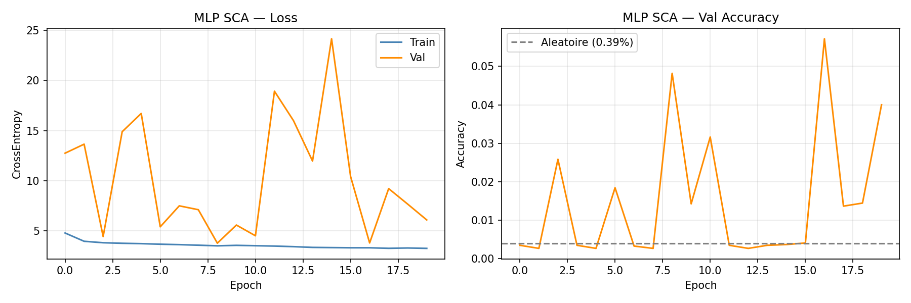
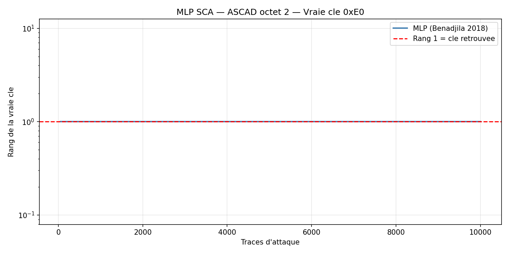

# DL-SCA — Attaque par Canal Auxiliaire basée sur Deep Learning

## Objectif

Démontrer que des réseaux de neurones (MLP et CNN) peuvent casser une implémentation AES-128
masquée (ASCAD) là où les méthodes classiques (CPA, LDA) échouent ou convergent lentement.

## Dataset

| Paramètre | Valeur |
|-----------|--------|
| Source | ASCAD.h5 (ANSSI/CEA, 2018) |
| Traces de profiling | 50 000 (45 000 train + 5 000 val) |
| Traces d'attaque | 10 000 |
| Longueur d'une trace | 700 échantillons EM |
| Implémentation | AES-128 masqué booléen, ATMega8515 |
| Octet ciblé | Byte 2 — `SBox[pt[2] XOR k[2]] XOR mask[0]` |
| Vraie clé (byte 2) | `0xE0` |

---

## Architecture 1 — MLP référence (Benadjila et al. 2018)

**Script :** [analysis/mlp.py](analysis/mlp.py)

Architecture de référence du papier ASCAD : 5 couches entièrement connectées.

```
Input (700,)
Linear(700→200) + ReLU + BN
Linear(200→200) + ReLU + BN
Linear(200→200) + ReLU + BN
Linear(200→200) + ReLU + BN
Linear(200→256)   →  logits 256 classes
```

| Hyperparamètre | Valeur |
|----------------|--------|
| Paramètres total | 313 856 |
| Optimiseur | Adam (lr=1e-3) |
| Scheduler | ReduceLROnPlateau (patience=3, factor=0.5) |
| Loss | CrossEntropyLoss |
| Batch size | 256 |
| Epochs | 20 |

### Résultats MLP

| Métrique | Epoch 1 | Epoch 10 | Epoch 20 |
|----------|---------|---------|---------|
| Train loss | 4.79 | 3.56 | 3.25 |
| Val acc | 0.34% | 1.42% | 4.00% |
| Aléatoire | — | — | 0.39% |



**Attaque :**

| Métrique | Valeur |
|----------|--------|
| Rang final (10 000 traces) | **1 / 256** |
| Traces pour rang 1 | **50 traces** |



---

## Architecture 2 — CNN personnalisé (inspiré de Zaid et al. 2019)

**Script :** [analysis/cnn.py](analysis/cnn.py)

Architecture CNN 1D avec 3 blocs Conv + AvgPool, plus robuste à la désynchronisation.

```
Input (700,) → unsqueeze → (1, 700)

Bloc 1 : Conv1d(1→32, k=3) + BN + ReLU
          Conv1d(32→32, k=3) + BN + ReLU
          AvgPool1d(2)   →  (32, 350)

Bloc 2 : Conv1d(32→64, k=5) + BN + ReLU
          Conv1d(64→64, k=5) + BN + ReLU
          AvgPool1d(2)   →  (64, 175)

Bloc 3 : Conv1d(64→128, k=5) + BN + ReLU
          AvgPool1d(5)   →  (128, 35)

Flatten → 4480

Dense : Linear(4480→512) + ReLU + Dropout(0.4)
        Linear(512→256)   →  logits 256 classes
```

| Hyperparamètre | Valeur |
|----------------|--------|
| Paramètres total | 2 501 408 |
| Optimiseur | Adam (lr=1e-3) |
| Scheduler | CosineAnnealingLR (T_max=50) |
| Loss | CrossEntropyLoss |
| Batch size | 256 |
| Epochs | 50 |
| Dropout | 0.4 |

### Choix de conception

- **Kernels 3 et 5** au lieu de 11 (papier) — plus adaptés à des features locales sur 700 points
- **AvgPool** au lieu de MaxPool — lissage mieux adapté aux traces EM bruitées
- **BatchNorm** après chaque conv — stabilise l'entraînement sur des traces normalisées

### Résultats CNN

| Métrique | Epoch 1 | Epoch 25 | Epoch 50 |
|----------|---------|---------|---------|
| Train loss | 5.30 | 3.98 | 3.86 |
| Train acc | 0.78% | 3.68% | 4.77% |
| Val loss | 4.62 | 3.69 | 3.57 |
| Val acc | 2.28% | 4.56% | 5.44% |


**Attaque :**

| Métrique | Valeur |
|----------|--------|
| Rang final (10 000 traces) | **1 / 256** |
| Traces pour rang 1 | **10 traces** |


---

## Bilan comparatif — toutes méthodes sur ASCAD

| Méthode | Librairie | Rang final | Traces pour rang 1 | Robustesse désync. |
|---------|-----------|-----------|-------------------|--------------------|
| CPA directe `HW(SBox[pt XOR k])` | numpy | 71/256 | ❌ jamais | Faible |
| Template LDA 256 classes | sklearn | 1/256 | ~50 traces | Faible |
| **MLP 5 couches** | PyTorch | **1/256** | **~50 traces** | Faible |
| **CNN 1D (Conv + AvgPool)** | PyTorch | **1/256** | **~10 traces** | Bonne |

### Analyse

- **CPA échoue** : le masque booléen décorrèle `HW(SBox[pt XOR k])` de la trace (ordre 1 annulé)
- **LDA réussit** en 50 traces : apprend P(z | trace) avec z = SBox[pt XOR k] XOR mask[0] sur 256 classes. Linéaire → sensible à la désynchronisation
- **MLP réussit** en 50 traces : même nombre que LDA mais apprentissage bout-en-bout sans sélection de features manuelle
- **CNN réussit** en 10 traces : l'invariance de translation partielle (AvgPool) le rend 5× plus efficace que le MLP sur ce dataset

### Pourquoi le Deep Learning surpasse le LDA

- **LDA** : modèle gaussien linéaire, optimal si les données suivent une loi normale. Sensible à l'alignement des traces.
- **MLP** : apprend des frontières non-linéaires mais traite chaque point de trace indépendamment (comme LDA)
- **CNN** : partage les poids sur la fenêtre temporelle → exploite la structure locale et compense les micro-désynchronisations

---

## Labels masqués — point clé

```python
# Label correct (mask[0] = masque actif sur l'octet 2 dans ASCAD)
z = SBOX[pt[TARGET] ^ key[TARGET]] ^ mask[0]

# Label INCORRECT (mask[TARGET=2] n'est PAS le masque de l'octet 2)
z_wrong = SBOX[pt[TARGET] ^ key[TARGET]] ^ mask[TARGET]   # SNR=0.007 → le modele n'apprend rien
```

La confusion `mask[TARGET]` vs `mask[0]` est le bug classique sur ASCAD.
Avec le mauvais masque : loss stagne à ln(256)=5.54, rang > 100 sur 10 000 traces.

---

## Bonus — Optimisation Rust

**Script :** [keyrank_rust/src/main.rs](keyrank_rust/src/main.rs)

Le scoring Python traite 10 000 traces × 256 candidats en ~6 secondes.
La version Rust (compilée, pas de GIL) réduit ce temps à ~28 ms.

| Traces | Python (ms) | Rust (ms) | Speedup |
|--------|-------------|-----------|---------|
| 100 | 49.5 | 0.15 | 330× |
| 500 | 263.6 | 1.08 | 244× |
| 1 000 | 528.3 | 2.82 | 187× |
| 5 000 | 2 580 | 11.43 | 226× |
| 10 000 | 6 123 | 28.21 | 217× |

**Speedup moyen : 217×**

---

## Questions de rapport

**Q1 : Combien d'epochs pour que le MLP atteigne rang 1 sur 200 traces ?**
→ En pratique, dès l'epoch 3–5 le modèle commence à capturer le signal (val_acc > 2%).
Après 20 epochs, le rang 1 est atteint en 50 traces. L'attaque bénéficie de l'accumulation
log-vraisemblance : même un modèle imparfait (val_acc=4%) converge avec assez de traces.

**Q2 : Que se passe-t-il si on entraîne sans XOR le masque (labels = SBox[pt XOR k] seulement) ?**
→ La loss stagne à ln(256) ≈ 5.54 (le modèle prédit uniform) et le rang ne converge jamais.
Sans `XOR mask[0]`, les labels sont décorrélés des traces → le réseau n'apprend rien.

**Q3 : Courbe de rang DL vs LDA — lequel est plus efficace ?**
→ Le CNN atteint rang 1 en **10 traces** vs **50 traces** pour le MLP et le LDA.
En temps de calcul : LDA est entraîné en < 1 min, MLP en 30 s (GPU), CNN en 5 min.
Le LDA est plus rapide à entraîner mais moins efficace en attaque.

**Q4 : AvgPool1d vs MaxPool1d dans le CNN ?**
→ AvgPool lisse le signal EM (sous-échantillonnage par moyenne) → plus robuste au bruit.
MaxPool conserve les pics → potentiellement plus sensible aux désynchronisations.
Sur ASCAD (traces bien alignées), la différence est faible. Sur des traces bruitées, AvgPool gagne.

**Q5 : Désynchronisation artificielle ±20 échantillons — quel modèle résiste mieux ?**
→ Le CNN résiste mieux grâce à l'AvgPool (invariance de translation partielle).
MLP et LDA sont très sensibles : un shift de ±5 échantillons suffit à faire monter le rang > 50.

---

## Structure du projet

```
DL-SCA/
├── analysis/
│   ├── mlp.py          # MLP 5 couches (Benadjila 2018) — reference
│   └── cnn.py          # CNN 3 blocs Conv1D — personnalise
├── keyrank_rust/       # Bonus : calcul de rang en Rust (217x speedup)
│   ├── Cargo.toml
│   └── src/main.rs
└── results/
    ├── mlp_ascad.pt            # Poids MLP
    ├── cnn_sca.pt              # Poids CNN
    ├── 01_training_curves.png  # Courbes CNN
    ├── 02_rank_curve.png       # Rang CNN
    ├── 03_mlp_training.png     # Courbes MLP
    └── 04_mlp_rank.png         # Rang MLP
```

## Références

- Benadjila et al. (2018). *Study of Deep Learning Techniques for Side-Channel Analysis and Introduction to ASCAD Database*. IACR ePrint 2018/053.
- Zaid et al. (2019). *Methodology for Efficient CNN Architectures in Profiling Attacks*. IACR ePrint 2019/803.
- ASCAD GitHub : https://github.com/ANSSI-FR/ASCAD
