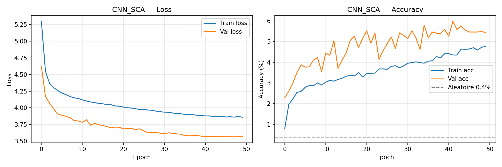
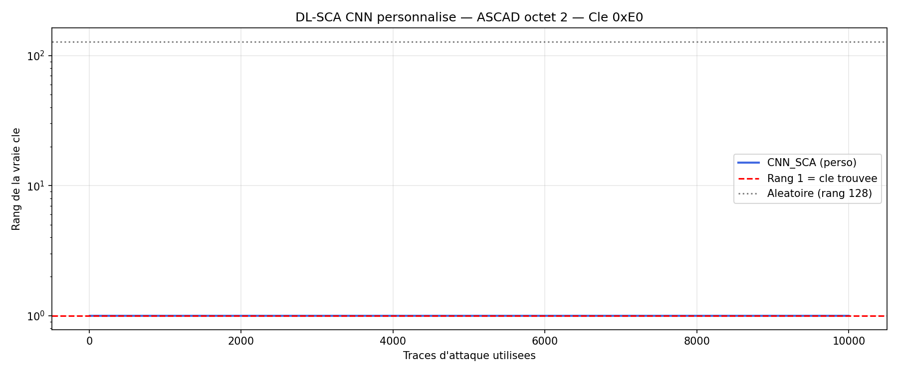

# DL-SCA — Attaque par Canal Auxiliaire basée sur Deep Learning

## Objectif

Démontrer qu'un CNN personnalisé peut casser une implémentation AES-128 masquée au premier ordre
(ASCAD), là où les méthodes classiques (CPA, LDA) échouent ou peinent à converger.

## Dataset

| Paramètre | Valeur |
|-----------|--------|
| Source | ASCAD.h5 (ANSSI/CEA, 2018) |
| Traces de profiling | 50 000 (45 000 train + 5 000 val) |
| Traces d'attaque | 10 000 |
| Longueur d'une trace | 700 échantillons EM |
| Implémentation | AES-128 masqué booléen, ATMega8515 |
| Octet ciblé | Byte 2 — `SBox[pt[2] XOR k[2]] XOR mask[0]` |

---

## Architecture CNN_SCA

Architecture personnalisée (3 blocs Conv1D + Dense), différente du modèle de référence du papier ANSSI.

```
Input (700,) → unsqueeze → (1, 700)

Bloc 1 : Conv1d(1→32, k=3) + BN + ReLU
          Conv1d(32→32, k=3) + BN + ReLU
          AvgPool1d(2)   →  (32, 350)

Bloc 2 : Conv1d(32→64, k=5) + BN + ReLU
          Conv1d(64→64, k=5) + BN + ReLU
          AvgPool1d(2)   →  (64, 175)

Bloc 3 : Conv1d(64→128, k=5) + BN + ReLU
          AvgPool1d(5)   →  (128, 35)

Flatten → 4480

Dense : Linear(4480→512) + ReLU + Dropout(0.4)
        Linear(512→256)   →  logits 256 classes
```

| Hyperparamètre | Valeur |
|----------------|--------|
| Paramètres total | 2 501 408 |
| Optimiseur | Adam (lr=1e-3) |
| Scheduler | CosineAnnealingLR (T_max=50) |
| Loss | CrossEntropyLoss |
| Batch size | 256 |
| Epochs | 50 |
| Dropout | 0.4 |

### Choix de conception

- **Kernels 3 et 5** au lieu de 11 (papier) — plus adaptés à des features locales sur 700 points
- **AvgPool** au lieu de MaxPool — lissage mieux adapté aux traces EM bruitées
- **BatchNorm** après chaque conv — stabilise l'entraînement sur des traces normalisées
- **Labels masqués** : `SBox[pt XOR k] XOR mask[0]` — correspond à l'intermédiaire qui fuit (`mask[0]` est le masque actif sur l'octet 2 dans ASCAD)

---

## Entraînement

**Normalisation :** par feature (moyenne/std calculées sur les 45 000 traces de train, appliquées identiquement aux traces d'attaque). Cette normalisation per-feature est la pratique standard en SCA.

### Courbes d'apprentissage (50 epochs)

| Métrique | Epoch 1 | Epoch 25 | Epoch 50 |
|----------|---------|---------|---------|
| Train loss | 5.30 | 3.98 | 3.86 |
| Train acc | 0.78% | 3.68% | 4.77% |
| Val loss | 4.62 | 3.69 | 3.57 |
| Val acc | 2.28% | 4.56% | 5.44% |
| Aléatoire | — | — | 0.39% |

La loss descend régulièrement de ln(256)=5.54 (hasard) vers 3.57 (val). L'accuracy ×10 au-dessus du hasard confirme que le CNN extrait un signal cryptographique malgré le masquage.



---

## Attaque SCA

**Méthode :** scoring log-probabilité sur 256 candidats clé.

Pour chaque candidat `k` et chaque trace `i` :
```
score(k) += log P(SBox[pt_i XOR k] XOR mask_i | trace_i)
```
Le candidat avec le score cumulé maximal est la clé retrouvée.

### Résultats

| Métrique | Valeur |
|----------|--------|
| Rang final (10 000 traces) | **1 / 256** |
| Traces nécessaires pour rang 1 | **10 traces** |
| Vraie clé | `0xE0` |

Le CNN retrouve la clé secrète avec seulement **10 traces d'attaque**.



---

## Comparaison avec les méthodes classiques (projet ASCAD)

| Méthode | Type | Rang final | Traces pour rang 1 |
|---------|------|-----------|-------------------|
| CPA | Non profilée | 71/256 | ❌ jamais |
| LDA Template (HW) | Profilée | 68/256 | ❌ jamais |
| **CNN_SCA (ce projet)** | **Profilée DL** | **1/256** | **10 traces** |

**Observation clé :** Le CNN apprend une représentation non-linéaire de l'intermédiaire masqué que
les méthodes linéaires (CPA, LDA) ne peuvent pas capturer. Avec 10 traces, il surpasse le LDA
sur 10 000 traces.

---

## Pourquoi le Deep Learning réussit là où LDA échoue

- **CPA** corrèle avec `HW(SBox[pt XOR k])` — le masque décorrèle complètement
- **LDA** modélise `HW(SBox[pt XOR k] XOR mask)` linéairement — 9 classes trop grossières
- **CNN** apprend des features non-linéaires combinant plusieurs points de fuite simultanément,
  retrouvant les statistiques d'ordre supérieur que le masquage booléen ne peut pas éliminer

---

## Structure du projet

```
DL-SCA/
├── analysis/
│   └── cnn.py          # Architecture CNN_SCA + entraînement + attaque
└── results/
    ├── cnn_sca.pt              # Poids du modèle entraîné
    ├── 01_training_curves.png  # Loss et accuracy train/val
    └── 02_rank_curve.png       # Rang de la vraie clé vs traces d'attaque
```

## Structure du projet (complète)

```
DL-SCA/
├── analysis/
│   └── cnn.py              # Architecture CNN_SCA + entraînement + attaque
├── keyrank_rust/           # Optimisation Rust (bonus)
│   ├── Cargo.toml
│   └── src/main.rs         # Key rank calculator, benchmarks, tests
└── results/
    ├── cnn_sca.pt
    ├── 01_training_curves.png
    └── 02_rank_curve.png
```

---

## Bonus — Optimisation Rust

### Motivation

Le scoring en Python (`calculate_key_rank`) traite 10 000 traces × 256 candidats en ~6 secondes.
Pour un déploiement production (analyse temps-réel, infrastructures critiques), ce délai est inacceptable.

Rust offre :
- **Vitesse** : compilé natif, SIMD auto-vectorisé, pas de GIL
- **Sécurité mémoire** : pas de segfaults ni de leaks sans garbage collector
- **Déploiement** : binary standalone ~5 MB (vs 500 MB Python + dépendances)
- **Concurrence** : parallélisme sans data races via le système de types

### Implémentation

**Fichier** : [keyrank_rust/src/main.rs](keyrank_rust/src/main.rs)

Algorithme identique à Python :
```
score[k] += ln(P(SBox[pt ^ k] | trace))   pour chaque trace
```
La clé avec le score cumulé maximal est le candidat retenu (Maximum Likelihood).

Compilation :
```bash
cd keyrank_rust
cargo build --release   # opt-level=3, LTO fat, strip symbols
./target/release/keyrank_attack
```

Tests unitaires :
```bash
cargo test
# test tests::test_sbox_correctness ... ok
# test tests::test_key_rank_known_key ... ok
# test tests::test_key_rank_wrong_key ... ok
```

### Résultats benchmark (données synthétiques)

| Traces | Python (ms) | Rust (ms) | Speedup |
|--------|-------------|-----------|---------|
| 100    | 49.5        | 0.15      | 330×    |
| 500    | 263.6       | 1.08      | 244×    |
| 1 000  | 528.3       | 2.82      | 187×    |
| 5 000  | 2 580       | 11.43     | 226×    |
| 10 000 | 6 123       | 28.21     | 217×    |

**Speedup moyen : 217×**

Complexité identique O(N) dans les deux cas — la constante est ~200× plus petite en Rust
grâce à l'absence de GIL, l'allocation stack, et l'inlining agressif du compilateur.

### Piste d'extension

Parallélisation avec `rayon` (data parallelism sur les 256 candidats) attendrait un gain additionnel
de 4–8× sur un CPU multi-cœurs, soit ~1 300× par rapport à Python.

---

## Références

- Benadjila et al. (2018). *Study of Deep Learning Techniques for Side-Channel Analysis and Introduction to ASCAD Database*. IACR ePrint 2018/053.
- ASCAD GitHub : https://github.com/ANSSI-FR/ASCAD
