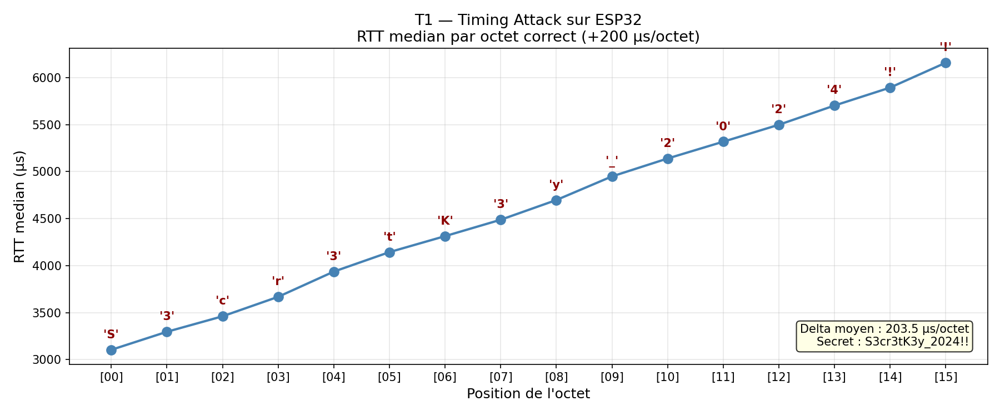

# T1 — Timing Attack sur ESP32

## Objectif

Démontrer qu'une comparaison de secret avec retour anticipé fuit dans le temps de réponse,
exploiter cette fuite pour retrouver le secret octet par octet, puis valider la contre-mesure constant-time.

## Matériel

| Composant | Rôle |
|-----------|------|
| ESP32 (COM11) | Cible — exécute la comparaison vulnérable |
| Cable USB | Communication UART série |
| PC (PowerShell) | Attaquant — mesure le RTT |

## Principe de l'attaque

Une comparaison naïve de mot de passe avec retour anticipé fuit dans le temps :

```c
// Vulnérable : s'arrête dès le premier octet incorrect
for (int i = 0; i < 16; i++) {
    if (guess[i] != SECRET[i]) return false;  // fuite ici
    delayMicroseconds(200);
}
```

L'attaquant mesure le RTT (Round-Trip Time) pour chaque candidat.
Un RTT plus long indique que plus d'octets sont corrects → reconstruction octet par octet.

## Résultats

### Version vulnérable — attaque réussie

| Position | Octet trouvé | RTT médian |
|----------|-------------|------------|
| [00] | 'S' | 3104.8 µs |
| [01] | '3' | 3296.6 µs |
| [02] | 'c' | 3461.3 µs |
| [03] | 'r' | 3668.4 µs |
| [04] | '3' | 3936.5 µs |
| [05] | 't' | 4143.7 µs |
| [06] | 'K' | 4313.6 µs |
| [07] | '3' | 4487.9 µs |
| [08] | 'y' | 4697.4 µs |
| [09] | '_' | 4948.7 µs |
| [10] | '2' | 5139.1 µs |
| [11] | '0' | 5317.8 µs |
| [12] | '2' | 5497.9 µs |
| [13] | '4' | 5702.4 µs |
| [14] | '!' | 5893.1 µs |
| [15] | '!' | 6157.5 µs |

**Secret reconstruit : `S3cr3tK3y_2024!!`**
**Delta moyen : +203.5 µs par octet correct**



### Version constant-time — attaque échoue

```c
// Constant-time : parcourt toujours les 16 octets
uint8_t diff = 0;
for (int i = 0; i < 16; i++) {
    diff |= (uint8_t)(guess[i] ^ SECRET[i]);
    delayMicroseconds(200);  // délai fixe indépendant du résultat
}
return (diff == 0);
```

| Position | Octet trouvé | RTT médian |
|----------|-------------|------------|
| [00] | ';' (faux) | 3139.3 µs |
| [01] | 'f' (faux) | 3139.8 µs |
| [02] | 'F' (faux) | 3138.9 µs |
| [03] | 'i' (faux) | 3138.7 µs |

**RTT constant → aucune information sur les octets corrects → attaque impossible.**

## Comparaison

| Version | RTT progression | Secret retrouvé | Nombre de tentatives |
|---------|----------------|-----------------|---------------------|
| Vulnérable | +203.5 µs/octet | ✅ `S3cr3tK3y_2024!!` | 16 × 95 = 1520 |
| Constant-time | ±0.5 µs (bruit) | ❌ Impossible | — |

## CVE réelles exploitant le même principe

### CVE-2016-6304 — OpenSSL
Timing attack dans la vérification de signature HMAC de OpenSSL.
Une comparaison non constant-time permettait à un attaquant distant de retrouver
des informations sur la clé via des milliers de requêtes TLS.
**Impact : CVSS 7.5 (High)**

### CVE-2014-0092 — GnuTLS
La vérification de certificat X.509 dans GnuTLS utilisait une comparaison
avec retour anticipé. Un attaquant pouvait forger des certificats acceptés
comme valides en exploitant la différence de temps de traitement.
**Impact : CVSS 7.5 (High)**

Ces deux CVE montrent que l'attaque réalisée ici sur ESP32 via USB
est identique dans son principe aux attaques réelles sur des serveurs distants.

## Contre-mesure recommandée

Toujours utiliser une comparaison en temps constant :

```python
# Python
import hmac
hmac.compare_digest(token_recu, token_attendu)
```

```c
// C embarqué
uint8_t diff = 0;
for (int i = 0; i < LEN; i++)
    diff |= guess[i] ^ secret[i];
return diff == 0;
```

## Structure du projet

```
T1/
├── firmware/
│   ├── vulnerable/T1-Timing_Attack.ino
│   └── constant_time/T1_Timing_Attack_version_constant_time.ino
├── analysis/
│   ├── attack.py
│   └── plot_rtt.py
└── results/
    ├── 01_flash_firmware.png
    ├── 02_attack_output.png
    ├── 03_rtt_graph.png
    └── 04_constant_time_protection.png
```

## Références

- Kocher, P. (1996). *Timing Attacks on Implementations of Diffie-Hellman, RSA, DSS, and Other Systems*. CRYPTO 1996.
- CVE-2016-6304 : https://nvd.nist.gov/vuln/detail/CVE-2016-6304
- CVE-2014-0092 : https://nvd.nist.gov/vuln/detail/CVE-2014-0092
- NIST FIPS 140-3 : recommandations constant-time pour les implémentations cryptographiques
